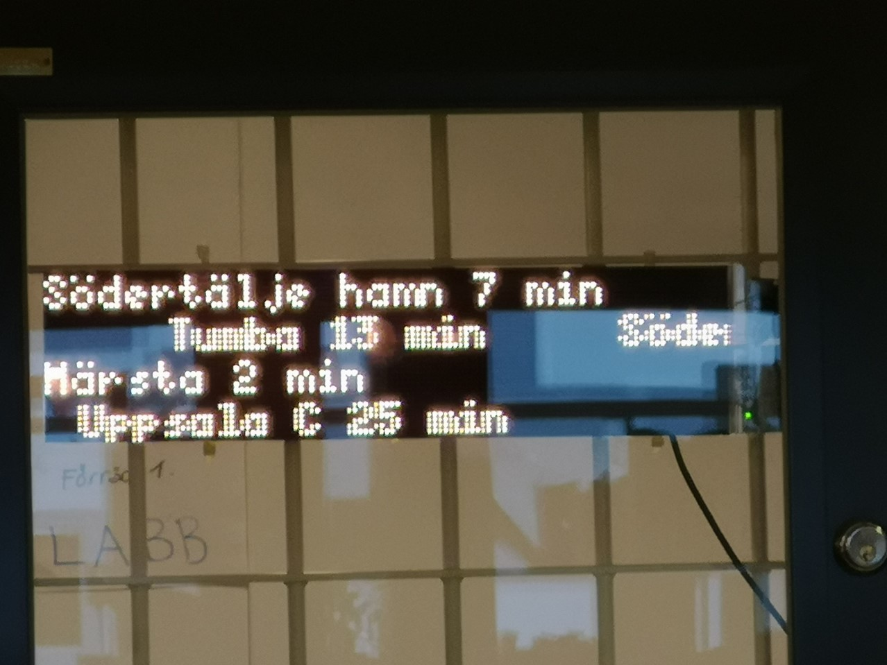
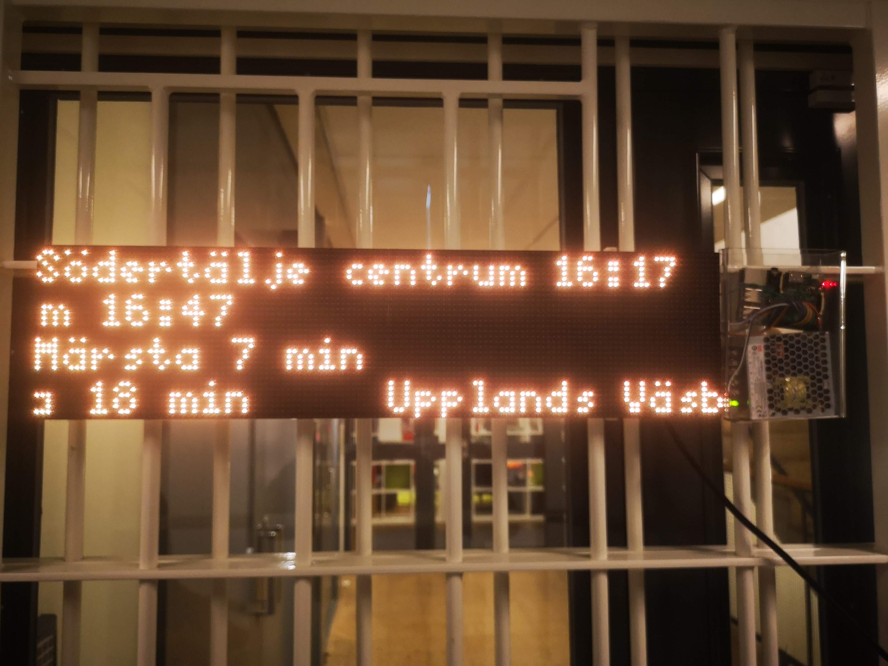
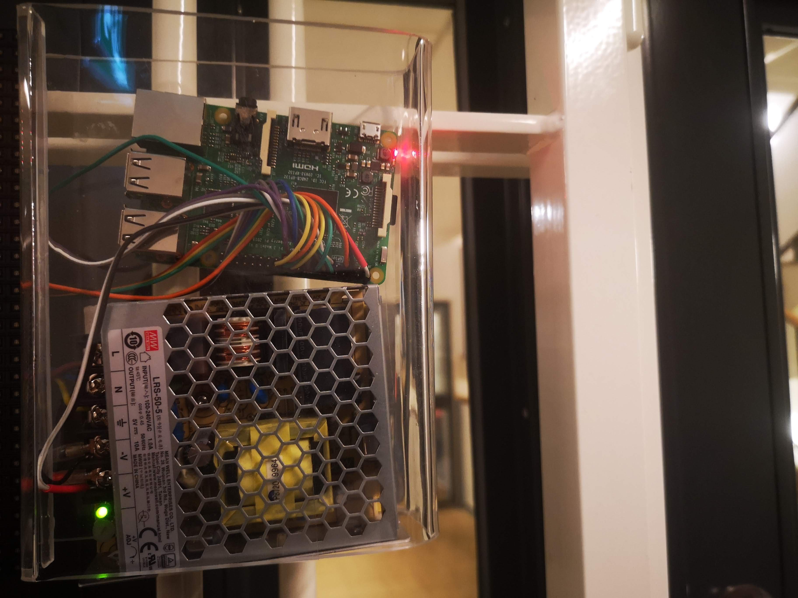

## LED-Display
A display in the office showing the train departures.

We are using "SL Realtidsinformation 4" API from https://www.trafiklab.se/

##### HW used:
1. Raspberry pi 3
2. LED matrix 64x16 - Two of this
3. Power supply
